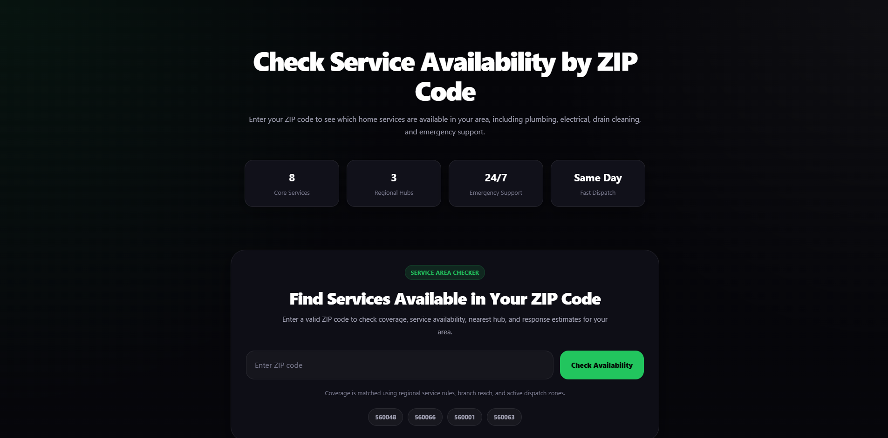

# a2rp-service-area-checker-ui

Single page React UI to check service availability by ZIP / postal code.

User enters a ZIP code and the interface shows which services are available in that service area (for example plumbing, electrical, drain cleaning, etc.). This type of UI is commonly used by regional service businesses to quickly inform customers whether their location is covered.



## Features

- ZIP code based service availability check
- Cascading service logic
- Clean single page interface
- Service cards with availability status
- Frontend only implementation

## Tech Stack

- React
- Vite
- styled-components

## Installation

```bash
git clone https://github.com/a2rp/a2rp-service-area-checker-ui.git
cd a2rp-service-area-checker-ui
npm install
npm run dev
```

## Follow me:

- GitHub: https://github.com/a2rp
- Portfolio: https://www.ashishranjan.net
- LinkedIn: https://www.linkedin.com/in/aashishranjan
- Facebook: https://www.facebook.com/theash.ashish/
- Youtube: https://www.youtube.com/@ashishranjan-ashz
